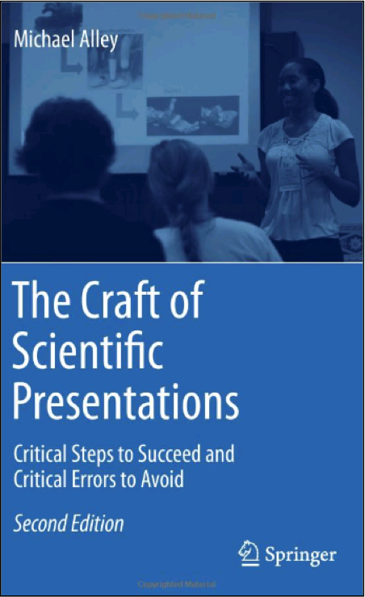
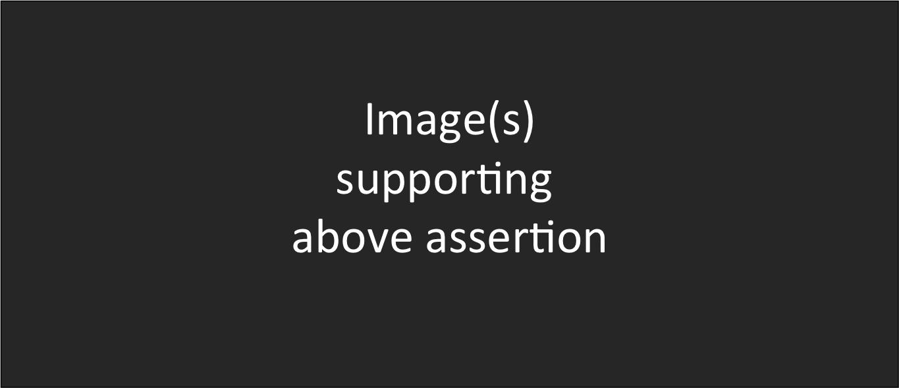

<!-- This DocOnce demo was made by Hans Petter Langtangen <hpl@simula.no>, -->
<!-- based on slides and ideas from Michael Alley. -->

% Assertion-Evidence Slide Template for Scientific Presentations
% **Michael Alley** at College of Engineering, Pennsylvania State University
% January 24, 2014

<!--  -->


<!-- !bnotes -->
This file is a template for making effective slides for scientific presentations. Although much about the layout and typography contrasts sharply with the defaults of PowerPoint, these changes are done so to make the slides more effective at communicating technical information. The design advocated by this template arises from Chapter 4 of The Craft of Scientific Presentations, 2nd edition (Springer, 2013). The homepage for this template exists at the first Google listing for presentation slides:http://writing.engr.psu.edu/slides.html

Right now you are viewing the notes pages. To work on the slides, click on *Slide* under *View*.

Tip: When creating a new presentation, save this file as the name of your presentation.

You are more than welcome to use this template for your presentation slides. You may not, though, distribute this template for profit or distribute this template without giving credit to the source.
<!-- !enotes -->

<!-- !split -->
## Title of Presentation in Initial Capitals: 36 Points, Calibri Bold

<!-- !bslidecell 00 0.35 -->
Name <br />
Department

<br />
<br />

Name <br />
Department

<br />
<br />

Logo(s)
<!-- !eslidecell -->

<!-- !bslidecell 01 0.65 -->
<!--  -->

<!-- !eslidecell -->

<!-- !bnotes -->
This slide template is for the title slide of a presentation. Consider repeating a key image from one of the slides later in the presentation. The image helps orient the audience to the key words in the title. This image also gives you the opportunity to say a few things about your work—perhaps addressing the work’s importance or providing key background information. Forcing yourself to spend more time with this slide is good because a common mistake in presentations is not to leave the title slide on long enough. Because of this mistake, many in the audience do not have the chance to comprehend the key details of the title. See pages 172-184 in The Craft of Scientific Presentations, 2nd ed. (CSP).

This template shows one layout for the slide. You might want to rearrange the placement of the body’s wording to accommodate a different sized image.
<!-- !enotes -->

<!-- !split -->
### Mapping slide: This presentation focuses on ... (complete sentence, but go no more than two lines)

<!-- Here: 3x3 table for three sections in the presentation -->

<!-- !bslidecell 00 -->
<!--  -->


Topic 1
<!-- !eslidecell -->

<!-- !bslidecell 01 -->
<!-- Empty cell (must have such a comment at least in an empty cell) -->
<!-- !eslidecell -->

<!-- !bslidecell 02 -->
<!-- Empty cell -->
<!-- !eslidecell -->

<!-- !bslidecell 10 -->
<!-- Empty cell -->
<!-- !eslidecell -->

<!-- !bslidecell 11 -->
<!--  -->

!
Topic 2
<!-- !eslidecell -->

<!-- !bslidecell 12 -->
<!-- Empty cell -->
<!-- !eslidecell -->

<!-- !bslidecell 20 -->
<!-- Empty cell -->
<!-- !eslidecell -->

<!-- !bslidecell 21 -->
<!-- Empty cell -->
<!-- !eslidecell -->

<!-- !bslidecell 22 -->
<!--  -->


Topic 3
<!-- !eslidecell -->

<!-- !bnotes -->
Mapping slide for the presentation (note that a background slide or a slide justifying the importance might precede this slide). A common mistake with mapping slides is to give the audience simply a boring and unmemorable vertical list of topics (including the names "Introduction" and "Conclusion" and "Questions"). Such a list is quickly forgotten after the slide is removed.

On a mapping slide, take the opportunity to show a key image or perhaps a representative image for each major section of the presentation. In the second case, each image would be repeated on the first visual of the corresponding section and would remind the audience that they have arrived to a major section of the presentation’s middle.

In regards to the names “Introduction” and “Conclusion,” every talk has those sections, and the names are ignored by audiences. So why state them? Also, for the divisions that you do have, find a logical and parallel grouping. Note that groups of two’s, three’s, and four’s are much easier to remember and are not so nearly intimidating as groups of five’s, six’s, and seven’s. See the example mapping slide in the textbook. (CSP, pages 177-181).
<!-- !enotes -->


<!-- !split -->
## Heading for Topic 1

This slide introduces a new section (according to the mapping slide)


<!-- !split -->
### Insert ordinary slide title

Insert text, figures, lists, ...

Note that slide cells are not supported for the Markdown format, so
text and figures must be above/below each other, not side by side.


<!-- !split -->
### Insert ordinary slide title


<!-- !bslidecell 00 -->
Here is a 2x2 cell slide with "bullet points" to the left and a
figure to the right.

<br />
<br />

Item 1 <br />
Item 2 <br />

or even bullet lists (!)

 * Item 1
 * Item 2

<!-- !eslidecell -->

<!-- !bslidecell 01 -->


<!-- !eslidecell -->

<!-- !split -->
### This sentence headline makes an assertion on the first topic in no more than two lines

<!--  -->


<!-- Add space -->
<br />
<br />
<br />

If necessary, identify key assumption or background for audience - keep to two lines

<!-- !bnotes -->
Body slide from the first section of the presentation’s middle. Consider having the first-topic image from the mapping slide repeated here. Use the headline (no more than two lines) to make an assertion about this topic. In the body of the slide, support that headline with images and with words, if necessary. See Chapter 4 of CSP.

This slide shows one orientation for the image and text in the body of the slide. Other orientations appear in this template. Choose the one that best supports your headline assertion.

Some institutions will insist that you place an institutional logo on each slide. Other institutions recommend a logo on the first slide and the last.  If you do place a logo on each slide, make sure that logo is at the bottom of the slide rather than the top. Placing the logo at the top (the place on a slide that receives the most emphasis) shifts the emphasis away from the work and to the people or place doing the work.
<!-- !enotes -->

<!-- !split -->
### Fragments quickly outpace the blast wave and become the primary hazard to personnel

<!--  -->


<!-- !bnotes -->
Sample slide from second section of the presentation’s middle. The image was such that there was no need for subordinate descriptions.


Reference: Jared Rochester, “Three Primary Products of an Explosive,” presentation (Aberdeen, MD: US Army Research Laboratory, 5 December 2005).
<!-- !enotes -->

<!-- !split -->
### Slides written in markup languages have good support for mathematics and computer code

<!-- !bblock makes blocks/frames -->

*Mathematics:* 

$$
 F(x) = \int_a^b f(x)dx
$$


*Computer code:* 

```python
import numpy

def trapezoidal(f, a, b, n=100):
    """Integrate f from a to b with 100 intervals."""
    x = numpy.linspace(a, b, n+1)
    F = (b-a)/float(n)*(numpy.sum(f(x)) - 0.5*(f(a) + f(b)))
    return F
```


<!-- !split -->
### In summary, this sentence headline states the most important assertion of the presentation

<!-- !bslidecell 00 -->
Supporting point (no more than
two lines)

<!-- Either bullet list, or vertical space, -->
<!-- <linebreak> -->
<!-- <linebreak> -->
<!-- or down arrow figure -->

<!--  -->


Another supporting point
(parallel to the first)

<br />
<br />
<!-- !bpop highlight-red -->
Questions?
<!-- !epop -->
<!-- !eslidecell -->

<!-- !bslidecell 01 -->
<!--  -->

<!-- !eslidecell -->

<!-- !bnotes -->
Conclusion slide. Use the headline (no more than two lines) to state your most important conclusion. Begin the headline with In summary or In conclusion to ensure that the audience knows they have come to the presentation’s end. Support that headline with an image and parallel points.

This slide should be your last slide. Audiences lose patience when they believe that they have come to the end, but other slides follow.

Notice that the word Questions appears at the bottom of this slide. That strategy is much more effective than burning a slide with just the word Questions. This slide allows the audience to look at the most important slide of the presentation during the question period. See CSP, pages 182-183.
<!-- !enotes -->

